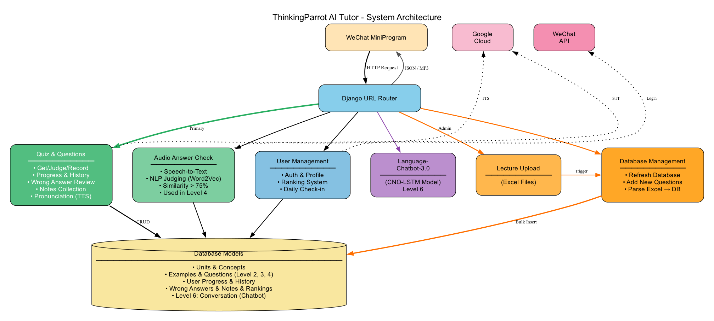

#  ThinkingParrot (有脑鹦鹉) Backend

**Django-based API Service for ThinkingParrot AI Learning Platform**

Backend service powering the [ThinkingParrot](https://github.com/liafonx/ThinkingParrot) English learning platform, providing RESTful APIs for quiz management, speech recognition, AI chatbot integration, and user progress tracking.

[](diagrams/Simple_Architecture.png)

---

## 🔗 Related Repositories

- **[ThinkingParrot](https://github.com/liafonx/ThinkingParrot)** - Main project overview, learning methodology, and documentation
- **[ThinkingParrot-Miniprogram](https://github.com/liafonx/ThinkingParrot-Miniprogram)** - WeChat Mini Program frontend
- **[Language-Chatbot-3.0](https://github.com/liafonx/Language-Chatbot-3.0)** - CNO-LSTM chatbot engine for Level 6

---

## 🛠️ Tech Stack

- **Python 3.7+** / **Django 2.2.5** - Backend framework
- **SQLite** (dev) / **MySQL** (prod) - Database
- **PyTorch** - Deep learning framework
- **CNO-LSTM** - Chaotic Neural Oscillatory LSTM for chatbot
- **NLTK** / **Word2Vec** - NLP for answer judging
- **Google Cloud** - Speech-to-Text & Text-to-Speech APIs
- **WeChat API** - User authentication

---

## 📁 Project Structure

```
ThinkingParrot-Backend/
│
├── Chatbot/                    # CNO-LSTM chatbot module
│   ├── ChaoticLSTM.py
│   ├── Chatbot.py
│   └── LeeOscillator.py
│
├── miniproject/                # Django project
│   ├── manage.py
│   │
│   ├── miniproject/            # Project settings
│   │   ├── settings.py
│   │   ├── urls.py
│   │   ├── views.py            # Chatbot API (Level 6)
│   │   └── wsgi.py
│   │
│   ├── questionRecord/         # Main app
│   │   ├── models.py           # 9 database models
│   │   ├── views.py            # 26 API functions
│   │   ├── urls.py
│   │   ├── audioRecognize.py   # Speech recognition & NLP judging
│   │   ├── forms.py
│   │   └── migrations/         # Database migrations
│   │
│   ├── static/                 # Static files (CSS, images)
│   └── template/               # HTML templates & Excel files
│
├── diagrams/                   # Architecture diagrams
├── requirements.txt            # Python dependencies
├── .gitignore                  # Git ignore rules
└── README.md                   # This file
```

---

## 🎯 Key Features

### Audio Answer Check (Level 4)
- Speech-to-Text via Google Cloud
- NLP-based judging using Word2Vec
- 75% similarity threshold
- Real-time feedback

### AI Chatbot (Level 6)
- Powered by [Language-Chatbot-3.0](https://github.com/liafonx/Language-Chatbot-3.0)
- CNO-LSTM for natural conversations
- Context-aware responses
- Realistic English practice

### Content Management
- Upload lectures via Excel files
- Bulk database operations
- Dynamic question generation

### Gamification
- Rankings & leaderboards
- Daily check-ins
- Progress tracking
- Wrong answer review

---

## 📡 API Endpoints

### Chatbot
- `POST /ChatbotGetMessage/` - AI conversation (Level 6)

### User Management
- `POST /questionRecord/userinfo` - Login/registration
- `POST /questionRecord/getUserInformation/` - User profile
- `POST /questionRecord/getUserRank/` - User rank
- `GET /questionRecord/getRank/` - Top 100 leaderboard
- `POST /questionRecord/signAddScore/` - Daily check-in

### Learning & Questions
- `GET /questionRecord/GetLectures/` - Available lectures
- `POST /questionRecord/getNewQuestion/` - Get questions by level
- `POST /questionRecord/getOneQuesiton/` - Single question
- `POST /questionRecord/getWrongQuestion/` - Wrong questions
- `POST /questionRecord/judgeAnswer/` - Judge answer (text/audio)
- `POST /questionRecord/recordAnswer/` - Record result
- `POST /questionRecord/correctAnswer/` - Mark corrected

### Progress & Collections
- `POST /questionRecord/getHistoryNum/` - History count
- `POST /questionRecord/getWrongNum/` - Wrong count
- `POST /questionRecord/getNotesCollection/` - Get collections
- `POST /questionRecord/toCollect/` - Add to collection
- `POST /questionRecord/toCancelCollect/` - Remove from collection

### Text-to-Speech
- `GET /questionRecord/textToSpeechEN/` - Generate English audio (MP3)
- `GET /questionRecord/textToSpeechEN_CN/` - Generate audio (SSML)

### Admin
- `POST /questionRecord/lectureUpdate` - Upload/update lectures
- `POST /questionRecord/refreshDatabase/` - Refresh from Excel
- `POST /questionRecord/addNewQuestion/` - Add questions
- `POST /questionRecord/recognize` - Direct audio recognition

---

## 🗄️ Database Models

9 main models power the learning system:

| Model | Purpose |
|-------|---------|
| `Unit` | Learning units/lectures |
| `Concept` | English concepts |
| `Example` | Example sentences |
| `Level2`, `Level3`, `Level4` | Question types |
| `CommonUser` | User profiles |
| `Progress` | Learning progress |
| `History` | Question history |
| `Wrong` | Wrong answers |
| `NotesCollection` | Collections |
| `DailyRank` | Rankings |

---

## 🚀 Installation

### Prerequisites

- Python 3.7+
- Google Cloud account (Speech & TTS APIs)
- WeChat Mini Program account
- MySQL (production) or SQLite (development)

### Setup

```bash
# 1. Clone repository
git clone https://github.com/liafonx/ThinkingParrot-Backend.git
cd ThinkingParrot-Backend

# 2. Install dependencies
pip install -r requirements.txt

# 3. Create key directory and add your credentials
cd miniproject
mkdir key
# Add these files to key/:
#   - django.key (Django secret key)
#   - miniprogram.key (WeChat app secret)
#   - database.json (Database config)
#   - radiant-snow-api.json (Google Cloud service account)

# 4. Run migrations
python manage.py migrate

# 5. Start server
python manage.py runserver
```

Server runs at `http://localhost:8000/`

---

**For project overview and learning methodology, visit [ThinkingParrot](https://github.com/liafonx/ThinkingParrot)**
